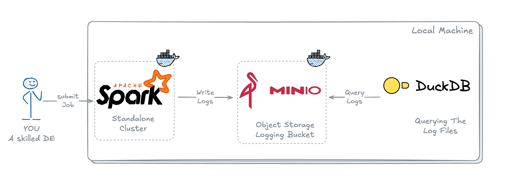

# Playground for trying SparkExceptionLogger Locally

---


To try SparkExceptionLogger locally, this contains the details to setup a playground in your local, that is the combination of:

- Spark Standalone Cluster,
- MinIO Object Storage to store the logs, and
- DuckDB to query the logs from MinIO Bucket.

This playground will simulate an environment just like with any Cloud Provider you are working with. For e.g., if you are on AWS this can be same as AWS EMR/Glue for running Apache Spark, AWS S3 as an Object Storage to write the logs and AWS Athena as a query engine to query the logs.

## Building Playground

---

### Creating Spark Standalone Cluster with MinIO

---

To create Spark Standalone Cluster with MinIO running on Docker, you can clone this [spark-minio-project](https://github.com/guptaakashdeep/spark-minio-project) repo and follow the instructions present in [README.md](https://github.com/guptaakashdeep/spark-minio-project/blob/main/README.md)

This will get you running with Spark Standalone Cluster and a MinIO Service.

### Setting up DuckDB

---

To setup DuckDB on your local, you can just run 2 commands to get it up and running.

You can follow the DuckDB installation instruction from [DuckDB Official Docs](https://duckdb.org/docs/installation/?version=stable&environment=cli&platform=macos&download_method=package_manager)

### Running SparkExceptionLogger

---

Once Spark Cluster and MinIO is up and running, 

- Take `test_spark_logger.py` script and `SparkExceptionLogger.py` present in this repo.
- Place it inside the `spark_apps` folder of the `spark-minio-project` repo you cloned.
- Run the below mentioned command to run the script on Spark Standalone Cluster.

```bash
# Running the spark-submit command on spark-master container
docker exec spark-master spark-submit --master spark://spark-master:7077 --deploy-mode client --jars /opt/extra-jars/hadoop-aws-3.3.4.jar,/opt/extra-jars/aws-java-sdk-bundle-1.12.262.jar --py-files ./apps/test_scripts/SparkExceptionLogger.py ./apps/test_spark_logger.py
```

Once the Spark Job is completed. It's time to query the logs using DuckDB.

### Querying Logs with DuckDB

---

To query logs written into MinIO Bucket, a DuckDB Secret needs to be setup, the same way it's required to be setup when querying from AWS S3.

You can follow the instructions below or run the sqls present in [SQL File](query_logs_duckdb.sql).

To setup DuckDB `SECRET`:

- Start DuckDB on a terminal

```bash
duckdb minio_db.db
```

- Create a `SECRET` by running the below SQL

```sql
CREATE SECRET minio_secrets (
    TYPE S3,
    KEY_ID 'admin', -- MINIO_USER
    SECRET 'password', -- MINIO_PASSWORD
    REGION 'us-east-1',
    ENDPOINT '127.0.0.1:9000', -- MINIO_ENDPOINT
    USE_SSL false,
    URL_STYLE 'path'
);
```

- Once `SECRET` is created, run the below command to query the logs written

```sql
FROM read_parquet('s3a://warehouse/logging/*/*.parquet', hive_partitioning = true);
```

You can modify the `test_spark_logger.py` as you like to playaround for your specific scenario.
